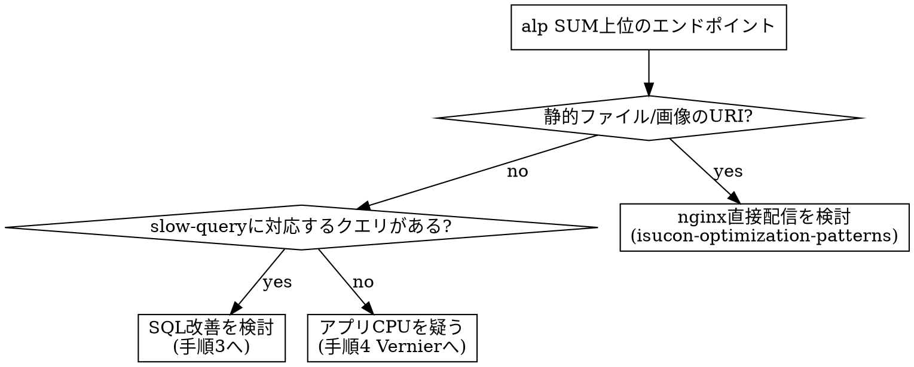

# ISUCON ボトルネック解析

## 概要

`make alp` / `make slow-query` / Vernier の出力から**次に直すべき1箇所**を決める。
鉄則（AGENTS.md）: **計測結果に基づかない改善はしない。推測でコードを変更しない。**

出力の解釈だけでなく、必ず「改善対象・根拠となる数値・期待効果」の3点セットで結論を出す。

## 前提の確認

集計する前に、ログが直近ベンチのものであることを確認する:

- 直近で `make bench` が実行されているか（ログ消去→ベンチの順になっているか）
- **他メンバーの計測中に `make bench` を叩かない**（ログが消え計測を破壊する）
- ログが空・少量なら集計しても無意味。ベンチを回してから解析する

## 手順1: alpで遅いエンドポイントを特定する

```bash
make alp   # SUM降順・上位40件（tool-config/alp/config.yml で設定済み）
```

| 列 | 意味 | 見方 |
|---|---|---|
| SUM | 合計レスポンス時間 | **改善優先度はこの順**。総時間を食っている所が点になる |
| COUNT | リクエスト数 | SUM大×COUNT大 → 1件を少し速くするだけで効く |
| AVG / P99 | 平均・テール | COUNT小×AVG大 → 1リクエストが重い処理（重いSQL/CPU） |
| 2XX〜5XX | ステータス | 4XX/5XXが多いURIはエラー自体がスコア減点の可能性 |
| BODY SUM | 転送量合計 | 大きければ画像/静的ファイル配信が疑わしい |

集計がURLごとにバラけている場合は `matching_groups` 未対応。先に `tool-config/alp/config.yml` を直す（isucon-initial-recon スキル手順5）。

## 手順2: 上位エンドポイントの中身を切り分ける



画像URIかつ画像がDBにBLOB格納されている場合は両方に該当する。その場合は「DBから出してnginx配信」（isucon-optimization-patterns パターン5）が正解で、クエリ改善よりも優先する。

補助: `reqtime`（nginx全体）と `apptime`（アプリ応答）の差が大きければnginx/ネットワーク側、ほぼ同じならアプリ以下が原因。

## 手順3: pt-query-digestでクエリを特定する

```bash
make slow-query
```

読み方:

- 冒頭の **Profile表**: `Response time %` 降順のランキング。上位から潰す
- 各クエリ詳細の **Count**: 同一パターンの実行回数
- **N+1の検出**: alpの該当エンドポイントのCOUNTに対してクエリCountが数倍以上ならN+1を疑い、一桁以上多ければ（例: リクエスト1,000件に対しクエリ50,000件）ほぼ確実にN+1
- `Rows examined` が `Rows sent` の数十倍以上 → インデックス不足。`EXPLAIN` で確認する

```bash
sudo mysql <db> -e "EXPLAIN <該当クエリ>\G"   # type=ALL（フルスキャン）ならインデックス候補
```

該当クエリがアプリのどこかは `queries/` 以下（`make extract-sql` の出力）をgrepして特定する。

## 手順4: アプリCPUが疑わしいときはVernier

slow-queryが軽いのにapptimeが大きい場合、Rubyコード自体がボトルネック。

```bash
# 導入・実行の詳細は isucon-vernier-profiling スキル参照
ENABLE_VERNIER=1 でベンチ → make vernier-view
```

`vernier-view`はMarkdown形式（AI向けフォーマット）で出力される。「Top Hotspots」（self-weight比率が高い順の関数一覧）を見て、JSONシリアライズ・テンプレート描画・外部コマンド呼び出し等を特定する。

## 結論の出し方

解析の最後に必ず以下の形式でまとめ、改善は isucon-optimization-patterns / isucon-server-tuning スキルに進む:

```
改善対象: GET /api/livestream/:id （N+1: commentsテーブルへのSELECTがリクエスト比50倍）
根拠: alp SUM 1位 320s / pt-query-digest Rank 1 (Response time 45%, Count 52,000)
期待効果: 全DB時間の45%がこのクエリ由来。JOIN化でSUM 1位エンドポイントの大幅短縮を見込む
```

期待効果は定性的で良い（「Response time X% を占めるクエリを排除」等）。スコア換算の正確な予測は不要で、次のベンチで実測する。

## よくある失敗

| 失敗 | 対策 |
|---|---|
| 「たぶんここが遅い」で改善に着手する | 必ずalp/slow-queryの数値を根拠にする |
| AVG順に見て、COUNTが多く総時間を食うエンドポイントを見落とす | SUM順で見る（config済み） |
| N+1をAVGだけで探す（1本1本は速いので出てこない） | Count列とリクエスト数の比で検出する |
| 古いログを集計して直近の変更を評価する | 直近の `make bench` 以降のログか確認する |
| 一度に複数の改善を入れて効果測定が不能になる | 1改善→1ベンチ→1計測のサイクルを守る |
