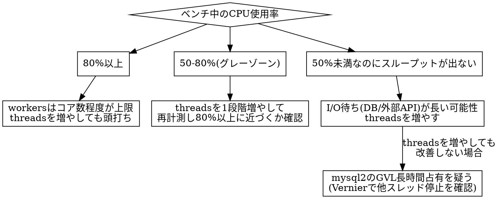

# ISUCON Pumaチューニング

## 概要

Pumaの `workers`（プロセス数）と `threads`（1ワーカーあたりのスレッド数）の組み合わせを、
アプリの並行処理特性に合わせて決める。**計測なしに「増やせば速くなる」ものではない**——
多すぎるとメモリ枯渇やコンテキストスイッチで逆に遅くなる。

設定ファイルは `<APP_DIR>/config/puma.rb`（または `puma.rb` 相当）。変更はローカル→push→デプロイ。

## 計測から構成を決める

```bash
ssh s1 "nproc"                        # 物理コア数
ssh s1 "dstat -c 1 5"                 # CPU使用率（ベンチ中に実行）
```

判断フロー:



threadsを増やしても改善しない場合、GVLをmysql2が長時間占有している可能性がある（詳細は次節）。

## 設定例

```ruby
# config/puma.rb
workers ENV.fetch("WEB_CONCURRENCY", 4).to_i   # まずはコア数と同数から
threads_count = ENV.fetch("RAILS_MAX_THREADS", 4).to_i
threads threads_count, threads_count

preload_app!   # マスタプロセスでアプリをロードしてからfork（起動時間短縮・COW共有でメモリ節約）

# workers > 1 のとき、DBコネクションはfork後に再接続する必要がある
on_worker_boot do
  # 例: DB.disconnect! や再接続処理をアプリの初期化コードに合わせて実装する
end
```

- **`workers` はコア数を超えて増やしても、CPUバウンドな処理では効果が頭打ちになる**（コンテキストスイッチのオーバーヘッドが増えるだけ）
- **`threads` はGVL（Global VM Lock）により、CPUバウンドな処理は並行実行されない。** I/O待ち（DB問い合わせ・外部API呼び出し）が多いエンドポイントでのみ複数スレッドの恩恵がある
- `preload_app!` を使う場合、DBコネクションなど fork 前に張った接続は `on_worker_boot` で張り直さないと、全ワーカーが同じコネクションを共有して壊れる

## mysql2使用時の注意（GVL長時間占有）

`mysql2` gem はクエリ実行中GVLを解放しない設定がデフォルトの場合がある（バージョンによる）。
マルチスレッドPuma（`threads` > 1）構成で、Vernierプロファイルで「mysql2のクエリ実行中、
他スレッドが全く進んでいない」ように見える場合はこれが疑わしい。
対応は `isucon-mysql2-to-trilogy` スキル（trilogyはGVLを適切に解放する）を参照。

## よくある失敗

| 失敗 | 対策 |
|---|---|
| CPU使用率を見ずにworkersを増やし続けてメモリ枯渇 | `dstat`/`free -h` で確認しながら段階的に調整 |
| GVLを理解せずthreadsだけ増やしてCPUバウンド処理が速くならない | CPU使用率で判断フローに従う |
| preload_app!使用時にfork後のDB再接続を忘れて全ワーカーが壊れる | `on_worker_boot` で再接続処理を書く |
| 複数の設定を同時に変えて何が効いたか分からない | 1設定→1ベンチのサイクルを守る（isucon-bottleneck-analysis参照） |
