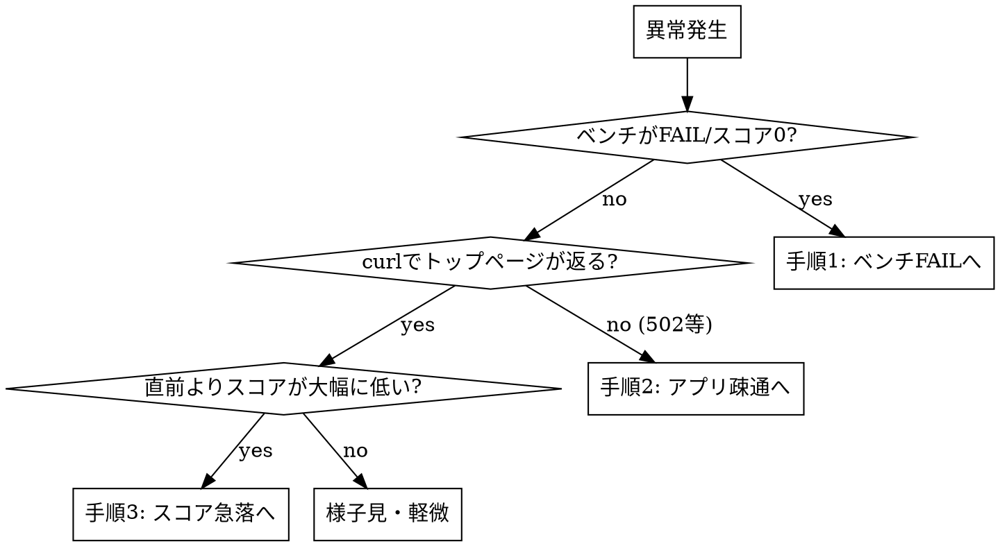

# ISUCON 障害対応

## 概要

競技中の異常はスコアそのものより**時間**が敵。原因究明に時間を溶かすより、まず復旧を最優先する。
**既定の動作は revert。** 直近の変更を疑い、`git revert` → 再デプロイ → 復旧確認を先に行い、原因調査は復旧後に回す。
1改善→1コミット→1ベンチのサイクル（isucon-bottleneck-analysis / isucon-optimization-patterns 参照）を守っていれば、
revert対象は常に「直近1コミット」に特定できる。守っていない場合は先に `git log` で怪しい範囲を絞る。

## 症状で分岐する



「様子見・軽微」の目安: 直前比でスコア低下が10%未満、かつ後続のベンチでも同水準なら計測誤差の範囲として様子見してよい。
10%以上、または2回連続で低下傾向が続く場合は「軽微」扱いをやめて手順3に進む。

## revert対象の特定（手順1・手順3共通）

- 1改善→1コミット→1ベンチを守れていれば、revert対象は常に直近1コミット。`git revert <直近の改善コミット>`
- 守れておらず複数コミットが未検証のまま積み上がっている場合、`git log --oneline -n 10` で怪しい変更（nginx設定・キャッシュ・インデックス・DBクライアント変更等）から順に、**1コミットずつ**revert→再デプロイ→再ベンチで戻るか確認する（一度に全部revertすると何が原因か分からなくなる）
- 直近の変更が複数コミットにまたがる1つの機能（featureブランチのマージ等）の場合、単一コミットのrevertでは不十分なことがある。マージコミットは `git revert -m 1 <マージコミット>` を使う

## 手順1: ベンチFAIL・整合性エラー

ベンチマーカーが0点/FAILを返す場合、直近の変更がレスポンス内容やDBの整合性を壊している可能性が高い。

1. **即座にrevert**: `git revert <直近の改善コミット>` → push → デプロイ → 再ベンチで復旧を確認する
2. 復旧を確認したら、ベンチマーカーのエラーメッセージ（期待値と実際の差分）を読む。多くは以下のどれか:
   - レスポンスのJSONキー・型・順序を変えてしまった（キャッシュ導入時に古い値を返している等）
   - `POST /initialize` が時間内に終わっていない、またはエラーになっている
   - 冪等性が必要な処理（POSTの二重送信対策等）を壊した
3. `make watch-service-log` でアプリ側のエラーログ（5xx・例外スタックトレース）を確認する
4. 原因が特定できたら、revert後の状態に**再度**同じ改善を、原因を修正した形で入れ直す（revertしたまま放置しない）

## 手順2: アプリが起動しない・502/499多発

```bash
ssh s1 "systemctl status <SERVICE_NAME>"        # active (running) か、失敗理由（Exit code）
ssh s1 "sudo journalctl -u <SERVICE_NAME> -n 50" # 直近の起動ログ・例外
ssh s1 "systemctl status <DB_SERVICE_NAME> nginx"
```

よくある原因:

- **直前のデプロイでbundle installが失敗/Gemfile.lockの不整合** → `cd <APP_DIR> && bundle check` で確認
- **DBが起動していない/接続できない** → アプリがDBより先に起動を試みて落ちていないか（`isucon-server-tuning` の起動順の節を参照）
- **設定ファイルの構文エラー**（nginx.confやmy.cnfを直前に変更した）→ `sudo nginx -t` / `mysqld --validate-config` で検証
- **ポート衝突・PIDファイル残留** → 前のプロセスが残っていないか `ps aux | grep <SERVICE_NAME>`

502/499がnginx側で出ている場合はアプリ側のタイムアウト・ワーカー枯渇を疑う（`isucon-puma-tuning` 参照）。

復旧しない場合も**まず直近のデプロイ・設定変更をrevertして復旧**を優先し、原因は復旧後に調べる。

## 手順3: デプロイ後にスコアが急落した

FAILはしていないがスコアが大きく下がった場合:

1. 直近1〜2コミットの diff を確認する（`git log -p -2`）。特に nginx 設定・キャッシュTTL・インデックス変更を疑う
2. **即座にrevert**して再ベンチし、スコアが戻るか確認する。戻ればその変更が原因と確定
3. 原因確定後、isucon-bottleneck-analysis の計測手順で「なぜ悪化したか」を数値で確認してから再度改善を入れ直す
   - よくある悪化パターン: キャッシュのTTLが長すぎて整合性エラー化、インデックス追加で書き込み（INSERT/UPDATE）側が逆に遅くなった、nginx keepaliveの設定ミスで逆に接続が詰まった

## よくある失敗

| 失敗 | 対策 |
|---|---|
| 原因究明を先にやって時間を溶かし、そのままタイムアップ | 復旧（revert）を最優先。調査は復旧後 |
| revertした後、直しても再度同じ改善を入れ直すのを忘れる | revertは一時措置。原因修正後に入れ直すまでがセット |
| 複数コミットが未検証のまま積み上がりrevert対象を特定できない | 普段から1改善→1コミット→1ベンチを徹底する（isucon-bottleneck-analysis参照） |
| サーバーのログを見ずに推測でコードを直す | `make watch-service-log` / `journalctl` で実際のエラーを確認してから直す |
