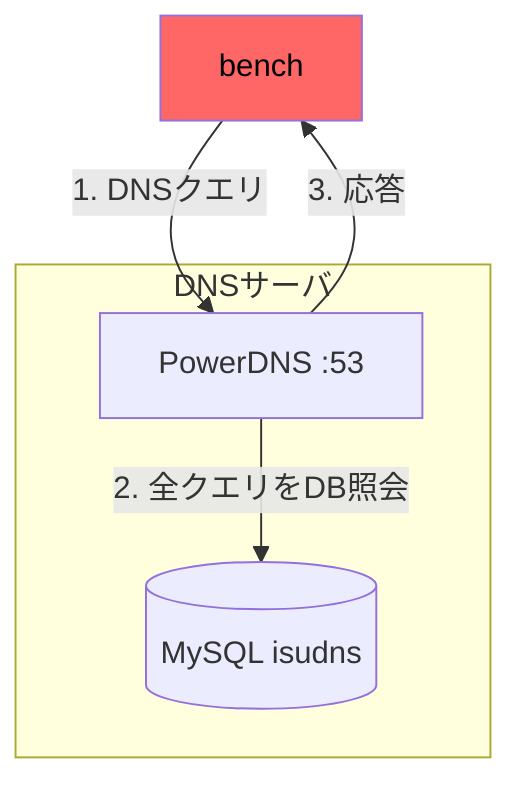
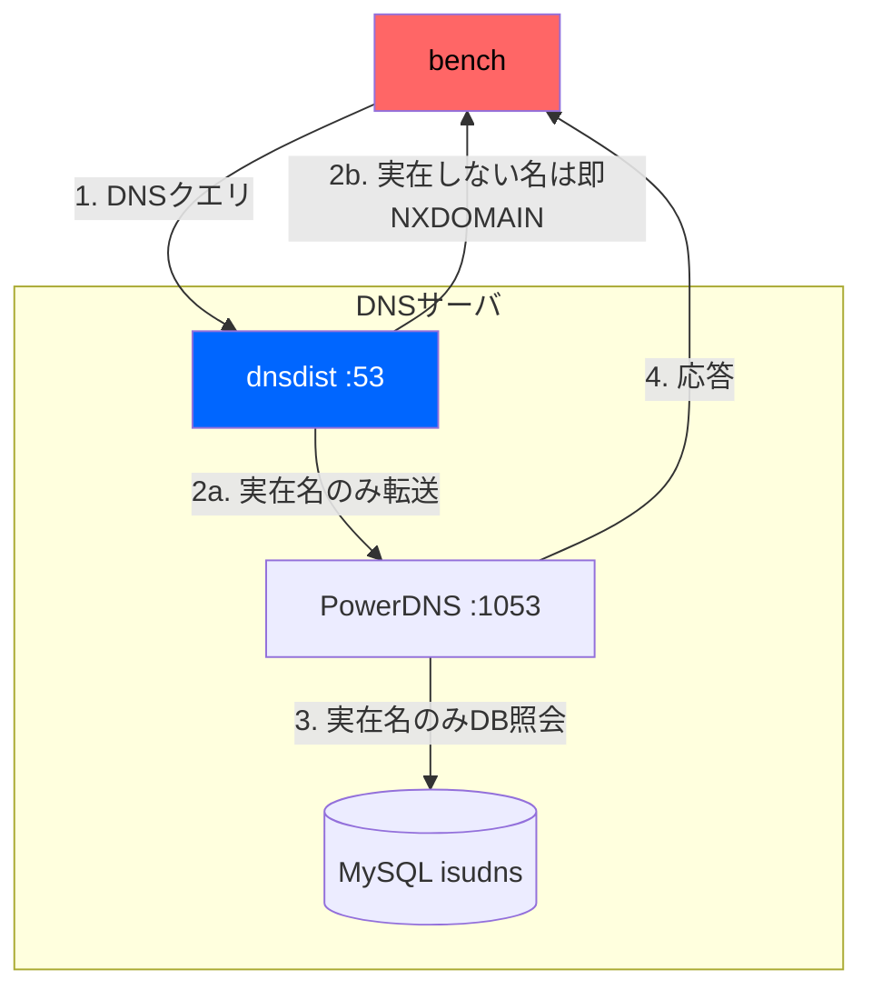

# アーキテクチャ図の描き方

## 目的

図は「全部見せる」道具ではなく、いまの問い以外を捨てて共有する道具。捨てないとノードが増え、
差分も読む順番も埋もれる。描く前に「この図で一眼で見せたいこと」を一文で固定する。

- 例: 構成変更前後で、サーバ間の通信経路がどう変わったか
- 例: 1リクエストが、どのサーバのどのプロセスを通るか

## 形式

- **アーキテクチャ図にする**: シーケンス図にしない。誰が誰に頼むかの時間軸ではなく、
  「どこに何が置かれ、どことつながるか」を見せる
- **階層を残す**: 「VPC → subnet → サーバ → プロセス」のように、実際の包含関係を
  `subgraph` で入れる。階層を落とすと、通信がサーバ間かサーバ内かが読めなくなる
- **時間順序は番号で示す**: 矢印ラベルの先頭に `1.` `2.` を付け、「この順で起きる」を示す。
  分岐は `2a.` `2b.`
- **before/after は同じ階層で2枚並べる**: 同じ subgraph 構成・同じノード配置にすると、
  変わった箇所だけが差分として目立つ。変更点のノードには色を付ける

## やらないこと

- 判断と処理の進み（flowchart）にしない。分岐条件や手順をノードにすると、
  構成を見せる図が処理を追う図に変わる

## 色

mermaid で `fill` を使うときは、背景色（fill）と文字色（color）をセットで指定する。
片方だけだと文字が読めなくなる。

- 濃い色には白字: `style Node fill:#0066ff,color:#fff`
- 明るい色には黒字: `style Node fill:#ff6666,color:#000`
- 黄緑（`#9f9` など）は中間の明度でコントラストを確保できないので使わない

## 例

問い: 「PowerDNSの前段にdnsdistを置いたことで、DNSクエリの経路がどう変わったか」

悪い例: after だけを描く。または before と after で subgraph の構成が違う。
何が増えて何が変わったかを、読者が2枚を見比べて探すことになる。

良い例: 同じ subgraph 構成で並べ、増えたノード（dnsdist）だけに色を付ける。

before:



after:



## 出力

必ず ```` ```mermaid ```` のコードブロックで書く。ファイルパス指定があればそこに書く。
